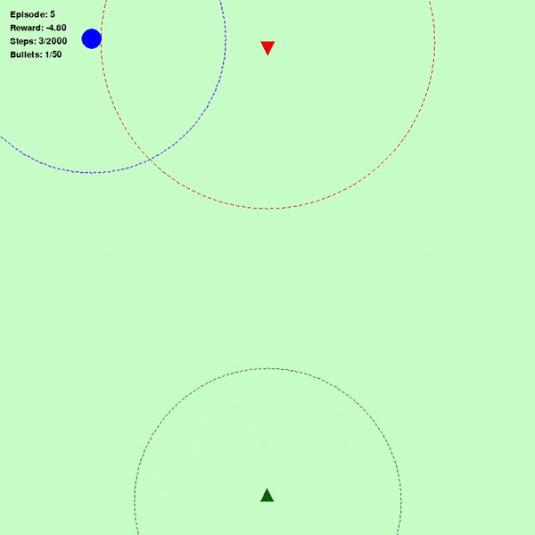
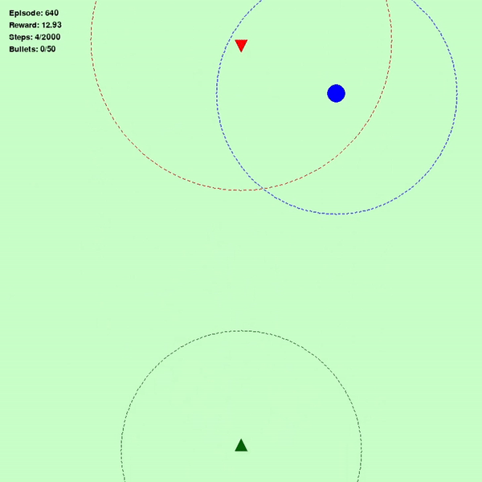

### Project
Developed an explainable deep reinforcement learning agent in a custom simulation environment to solve complex, multi-objective tasks with transparent decision-making.

Figure 1 (Left) represents the initial stages of agent's performance (Green triangle: Agent, Red triangle: Enemy, Blue circle: Target), Figure 2 (Middle) represents the agent's performance after 640 episodes, Figure 3 (Right) represents the agent's performance when it has learnt completely about the environment

  
  
  

<!-- 

  <figure style="display: inline-block; text-align: center; margin: 10px;">
    
    <figcaption>Caption for GIF 1</figcaption>
  </figure>
  <figure style="display: inline-block; text-align: center; margin: 10px;">
    
    <figcaption>Caption for GIF 2</figcaption>
  </figure>
  <figure style="display: inline-block; text-align: center; margin: 10px;">
    
    <figcaption>Caption for GIF 3</figcaption>
  </figure>

 -->

<!-- <video width="600" controls>
  <source src="media/media1.mp4" type="video/mp4">
  Your browser does not support the video tag.
</video> -->

<!-- 

  <video width="300" controls>
    <source src="media/media1.mp4" type="video/mp4">
    Your browser does not support the video tag.
  </video>
  <video width="300" controls>
    <source src="media/media1.mp4" type="video/mp4">
    Your browser does not support the video tag.
  </video>
  <video width="300" controls>
    <source src="media/media1.mp4" type="video/mp4">
    Your browser does not support the video tag.
  </video>

 -->

<!-- 

  <figure>
    <video width="300" controls>
      <source src="media/media1.mp4" type="video/mp4">
      Your browser does not support the video tag.
    </video>
    <figcaption>Caption for Video 1</figcaption>
  </figure>
  <figure>
    <video width="300" controls>
      <source src="media/media1.mp4" type="video/mp4">
      Your browser does not support the video tag.
    </video>
    <figcaption>Caption for Video 2</figcaption>
  </figure>
  <figure>
    <video width="300" controls>
      <source src="media/media1.mp4" type="video/mp4">
      Your browser does not support the video tag.
    </video>
    <figcaption>Caption for Video 3</figcaption>
  </figure>

 -->

### Contributions

- Sophisticated Reward Function Design: Developed a comprehensive reward function that balances multiple competing objectives, such as efficiency and resource management. This function integrates various factors that drive effective learning, encouraging the agent to optimize both task completion and the use of available resources.

- Implementation of a DRL Agent in a Custom Simulation Environment: Built and trained a DRL-based AI agent within a customized Pygame simulation environment to solve a complex problem with multiple objectives—navigating the environment, hitting designated targets, and appropriately avoiding or engaging enemies. The agent successfully completes the task in over 80% of trials, demonstrating robust decision-making capabilities under various scenarios.

- Comprehensive Learning Curve Analysis: Provided a detailed analysis of the agent’s learning trajectory, showcasing the progression from initial poor performance to improved efficiency in task completion. This analysis highlights how the agent refines its strategies over time, contributing to a deeper understanding of DRL learning processes.

- Advancement in Explainable AI for Multi-Objective Problems: The project demonstrates that DRL can effectively address complex, multi-objective problems. The insights gained from the reward function and decision-making analysis contribute to the broader understanding and improvement of explainability in AI-driven processes.

- Explainability through Factual and Counterfactual Analysis: By examining both factual and counterfactual actions and rewards, the project enhances the transparency of the AI agent's decision-making process. This analysis provides critical insights into why certain actions are chosen over others, allowing users to comprehend the reasoning behind specific decisions, especially in complex scenarios requiring quick responses.

### Author Details
Name: Swati Kar

Email: kars@clarkson.edu

### Supervisor 
Name: Dr. Mahesh Banavar

### Installation
1. Install conda 
2. create new environment `conda env create  jetFight_`
3. Conda activate environment `conda activate jetFight_`
4. Install all dependencise `pip install -r requirements.txt`

## Citation

If you find our work useful, please consider citing:

S. Kar, S. Dey, M. K. Banavar, and S. K. Sakib, “Fighter Jet Navigation and Combat using Deep Reinforcement Learning with Explainable AI,” *arXiv preprint*, arXiv:2502.13373, 2025. [Online]. Available: [https://arxiv.org/abs/2502.13373](https://arxiv.org/abs/2502.13373)

